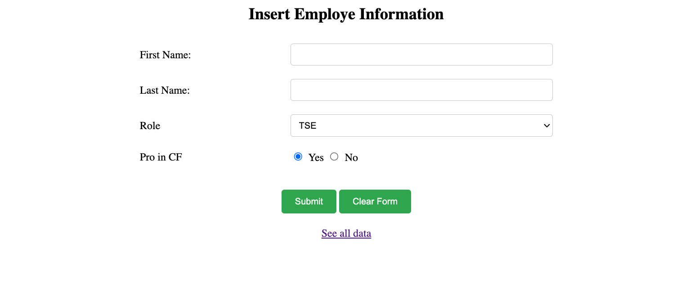
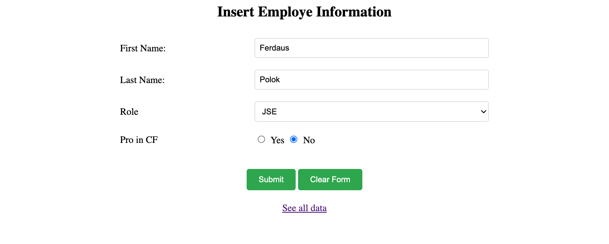
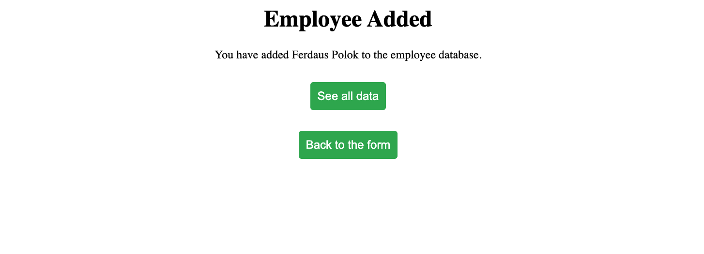
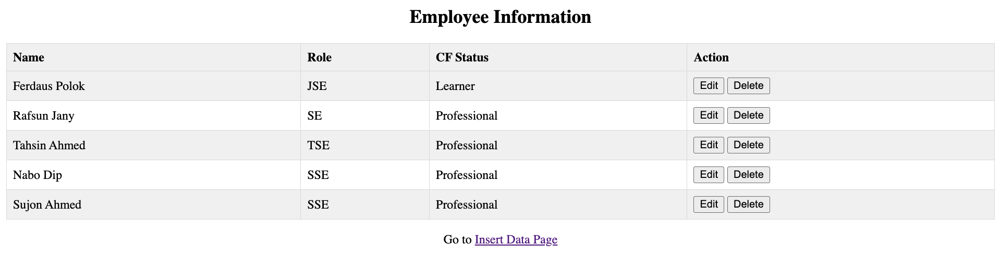
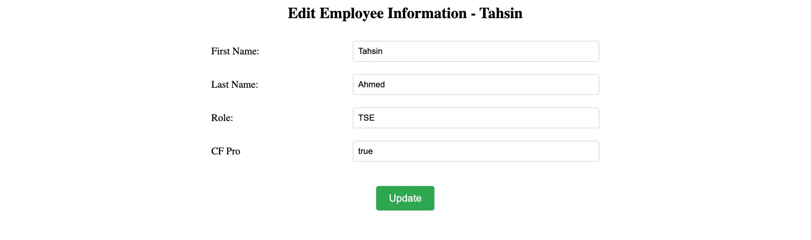
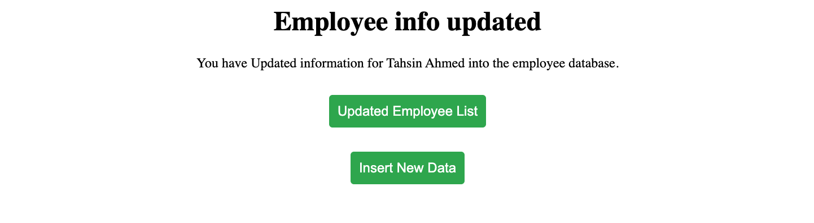

# Short description

This is basically a simple ColdFusion application made on practice purpose. In this application we have done the CRUD operation using simple form in FE and PSQL DB and our database. The `.cfm` files are written mostly written with `tags` rather than `scripts`.

## Prerequisite to run the application.

1. You need to install `box`/ `coldbox` which will eventually provide a `lucee` server to run coldFusion codes.
2. You need to add your local PSQL DB with `lucee` server by going to the admin page: http://localhost:PORT_HERE/lucee/admin/

## How to run the application

1. Clone this Repo using `https://github.com/fza-wtag/ColdFusion-simple-form-app.git`
2. Open cmd and type `box start server <random_server_name>`

## Media

